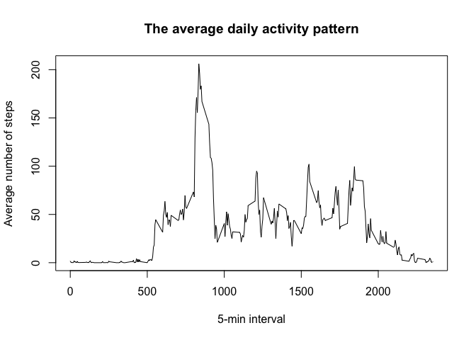
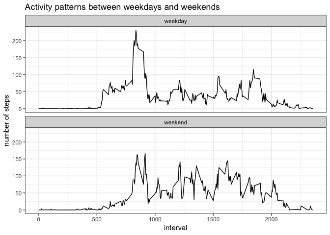

```r
knitr::opts_chunk$set(echo = TRUE)
```


## Loading and preprocessing the data

Unziping the file and loading the data. Transforming the type of variable "date"
into class date.


```r
unzip("activity.zip")
data <- read.csv("activity.csv")
data$date <- as.Date(as.character(data$date), "%Y-%m-%d")
```


## What is mean total number of steps taken per day?

Calculating the total number of steps taken per day.  
The histogram of the total number of steps taken per day is showed below.  


```r
library(dplyr)
```

```
## 
## Attaching package: 'dplyr'
```

```
## The following objects are masked from 'package:stats':
## 
##     filter, lag
```

```
## The following objects are masked from 'package:base':
## 
##     intersect, setdiff, setequal, union
```

```r
totalSteps <- data %>%
        group_by(date) %>%
        summarise(steps = sum(steps, na.rm = TRUE))
hist(totalSteps$steps, xlab = "Steps", 
     main = "Total number of steps taken per day")
```

<!-- -->

```r
meanOfSteps <- mean(totalSteps$steps)
medianOfSteps <- median(totalSteps$steps)
```

The mean and median total number of steps taken per day are 
9,354.23 and 
10,395 respectively.

## What is the average daily activity pattern?

The average daily active pattern is showed below. The x-axis is the 5-minute
interval in one day, the y-axis is the average number of steps taken at that 
5-minute interval across all days.


```r
byInterval <- data %>%
        group_by(interval) %>%
        summarise(steps = mean(steps, na.rm = TRUE))
with(byInterval, plot(interval, steps, type = "l",
                      xlab = "5-min interval",
                      ylab = "Average number of steps",
                      main = "The average daily activity pattern"))
```

<!-- -->

```r
max <- byInterval$interval[which.max(byInterval$steps)]
```

The 835th 5-minute interval contains the maximum number of steps in daily 
actvity.


## Imputing missing values

Here, I filled the missing values using the mean for that 5-minute interval.


```r
NAs <- sum(!complete.cases(data))

dataFilled <- data
for(i in seq(nrow(dataFilled))){
        if(is.na(dataFilled$steps[i])){
                interval.i <- which(byInterval$interval == dataFilled$interval[i])
                dataFilled$steps[i] <- byInterval$steps[interval.i]
        }
}

totalSteps <- dataFilled %>%
        group_by(date) %>%
        summarise(steps = sum(steps, na.rm = TRUE))
hist(totalSteps$steps, xlab = "Steps", 
     main = "Total number of steps taken per day")
```

<!-- -->

```r
meanOfSteps <- mean(totalSteps$steps)
medianOfSteps <- median(totalSteps$steps)
```

There are totally 2304 missing values in the dataset.  

`dataFilled` is a new dataset that equal to the original data with all NAs 
imputed with the mean for that 5-min interval. 

The mean and median total number of steps taken per day with imputed data are
10,766.19 and 
10,766.19 respectively. They are different from
the estimates from the first part of the assignment. Imputing missing data
 increased the estimates of the total daily number of steps.

## Are there differences in activity patterns between weekdays and weekends?

The plot of activity patterns between weekdays and weekends is showed below. The 
x-axis showed the 5-minute intervals in one day, the y-axis showed the average 
number of steps taken at that 5-minute interval across all days.


```r
dataFilled$wday <- weekdays(dataFilled$date, abbreviate = TRUE)
for(i in seq(nrow(dataFilled))){
        if(dataFilled$wday[i] %in% c("Sun", "Sat")) {
                dataFilled$wday[i] <- "weekend"
        } else {
                dataFilled$wday[i] <- "weekday"
        }
}
dataFilled$wday <- as.factor(dataFilled$wday)

byInterval2 <- dataFilled %>%
        group_by(interval, wday) %>%
        summarise(steps = mean(steps, na.rm = TRUE))

library(ggplot2)
ggplot(data = byInterval2, aes(interval, steps)) +
        geom_line() +
        facet_wrap(wday~., nrow = 2) +
        labs(y = "number of steps", 
             title = "Activity patterns between weekdays and weekends")+
        theme_bw()
```

<!-- -->

The activity pattern in weekdays is different from that in weekend. There is a
significant peak at around 800th interval during weekdays but not during weekends.
